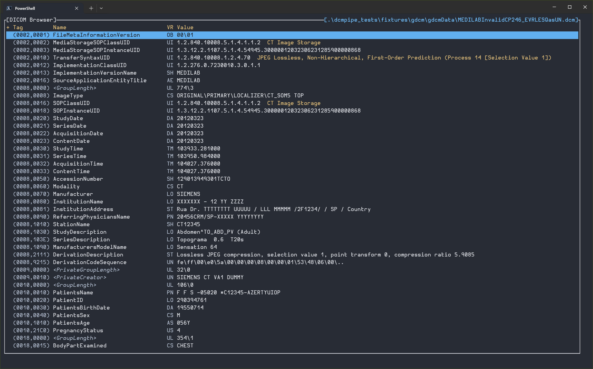

# dcmpipe #

## About ##
The `dcmpipe` library provides baseline functionality for managing DICOM,
including reading and writing DICOM files as well communicating using the DIMSE
network protocol.

See the `dcmpipe_cli` sub-crate for example command-line utilities built using
the library:



## Quick Example ##

```rust
// Set up a parser for a DICOM file.
let mut parser: Parser<'_, File> = ParserBuilder::default()
    // Stops parsing once the PixelData element is seen.
    .stop(TagStop::BeforeTagValue(&PixelData))
    // The dictionary is used during parsing for Implicit VR transfer syntaxes,
    // and associates the resolved VR to the resulting elements for parsing the
    // element values.
    .build(file, &STANDARD_DICOM_DICTIONARY);

// The parser is an iterator over elements.
for element_res in parser {
    let element = element_res?;
    let value = element.parse_value()
        // Parsing returns a Result<RawValue>
        .ok()
        // RawValue::string() returns Option<String>
        .and_then(|v| v.string())
        .unwrap();
}
```

Refer to the `readme.md` in `dcmpipe_lib/` folder for further examples.

## Design Goals ##
The APIs are not designed to encode the DICOM Information Object Definitions
within its type system. It will allow both reading and writing structures which
are valid DICOM binary protocol but it is up to the user of the API to ensure
that IODs are structured appropriately, e.g. that all necessary DICOM elements
are present for a CT, MR, etc.

While this design puts the burden on the API user to create well-formed DICOM
structures, it allso allows for working with existing malformed DICOM datasets.

This library includes tags, transfer syntaxes, UIDs, etc. from the DICOM
standard, available as a crate feature. The core of parsing and writing DICOM
does not rely on needing these definitions, allowing the option to not include
the entire DICOM standard to keep the compilation size small if needed.

The core library itself has minimal dependencies, currently two required and two
optional.

- `encoding_rs` (required) for properly handling text encoding supported by
  DICOM.
- `thiserror` (required) for deriving errors.
- `phf` (optional) the DICOM standard library components are encoded in a lookup
  map using perfect hash maps.
- `libflate` (optional) for reading and writing deflated datasets.

The API is also focused on enabling efficient operations:

- DICOM datasets are parsed in a stream-like manner allowing the API user to
  decide what is necessary to keep in-memory.
- DICOM element values themselves are not parsed during parsing of the dataset
- Flexible options for limiting how much of a DICOM dataset to parse.
- DIMSE handling of DICOM dataset communication does not require the entire
  dataset to be loaded into memory at once.

## Crates ##

- `dcmpipe_cli`: Command-line tools utilizing the `dcmpipe` library. See the
  `readme.md` within that sub-folder for more information.
- `dcmpipe_dict_builder`: Parses the DICOM Standard XML files for producing the
  standard DICOM dictionary. This is intended to be used by `build.rs` scripts.
- `dcmpipe_lib`: The core API for reading and writing DICOM, and optional
  support for the DICOM Message Exchange network protocol.

